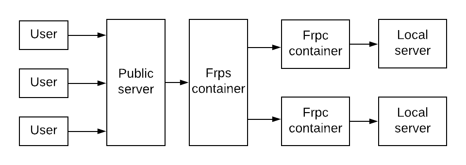

Access the host after behind LAN (cannot be connected with a public ip). Thanks for [fatedier](https://github.com/fatedier/frp). 



Make a conf folder including frps.ini and frpc.ini. See [fatedier](https://github.com/fatedier/frp) for more detail.

frps:

```
docker run -e "TYPE=frps" --net host -d -v path_to_conf:/conf sldai/frp
```

frpc:

```
docker run -e "TYPE=frpc" --net host -d -v path_to_conf:/conf sldai/frp
```